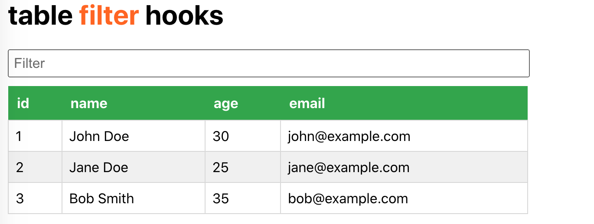

## install and start
```
yarn install

yarn start
```
Runs the app in the development mode Open [http://localhost:3000](http://localhost:3000) to view it in your browser.

## 1.useFilterableData api



```
import React, { useState } from 'react';
 
// 自定义钩子，用于过滤数据
function useFilterableData(initialData) {
  const [filterText, setFilterText] = useState('');
  const [filteredData, setFilteredData] = useState(initialData);
 
  // 当过滤文本改变时，更新过滤后的数据
  const handleFilterChange = (event) => {
    const filterText = event.target.value;
    const filteredItems = initialData.filter((item) =>item.name.toLowerCase().includes(filterText.toLowerCase()))
    setFilterText(filterText);
    setFilteredData(filteredItems);
  };
  return { filterText, filteredData, handleFilterChange };
}

export default useFilterableData
```

