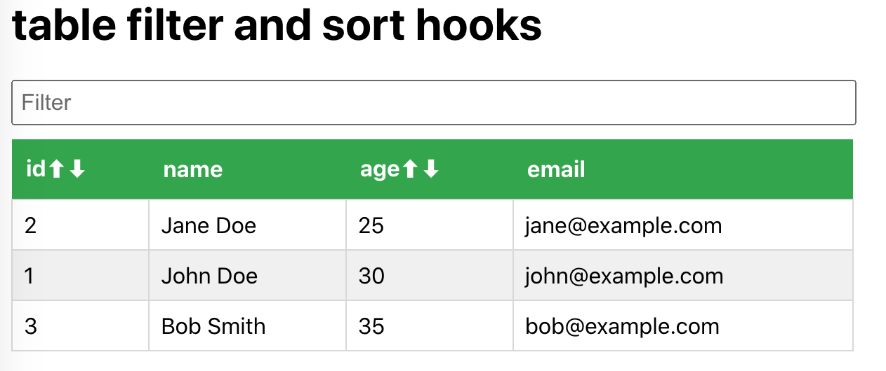

## install and start
```
yarn install

yarn start
```
Runs the app in the development mode Open [http://localhost:3000](http://localhost:3000) to view it in your browser.

## 1.useFilter api


```
import { useState } from 'react';
// custome hooks, filter data
function useFilter(initialData) {
  const [filterText, setFilterText] = useState('');
  const [filteredData, setFilteredData] = useState(initialData);
 
  // update data when filter text changes
  const handleFilterChange = (event) => {
    const filterText = event.target.value;
    const filteredItems = initialData.filter((item) =>item.name.toLowerCase().includes(filterText.toLowerCase()))
    setFilterText(filterText);
    setFilteredData(filteredItems);
  };
  return { filterText, filteredData, handleFilterChange };
}

export default useFilter
```
## 2.useSort api



```
import { useState } from 'react';

// custome hooks, sort data
function useSort(initialData, initialKey = 'id', initialDirection = 'asc') {
  const [sortData, setData] = useState(initialData);
  const sortedDataByKey = (initKey, initDirection = 'asc') => {
    const sortedData = [...initialData].sort((a, b) => initDirection === 'asc' ? a[initKey] - b[initKey] : b[initKey] - a[initKey]);
    setData(sortedData);
  };

  return { sortData, sortedDataByKey };
}

export default useSort
```

